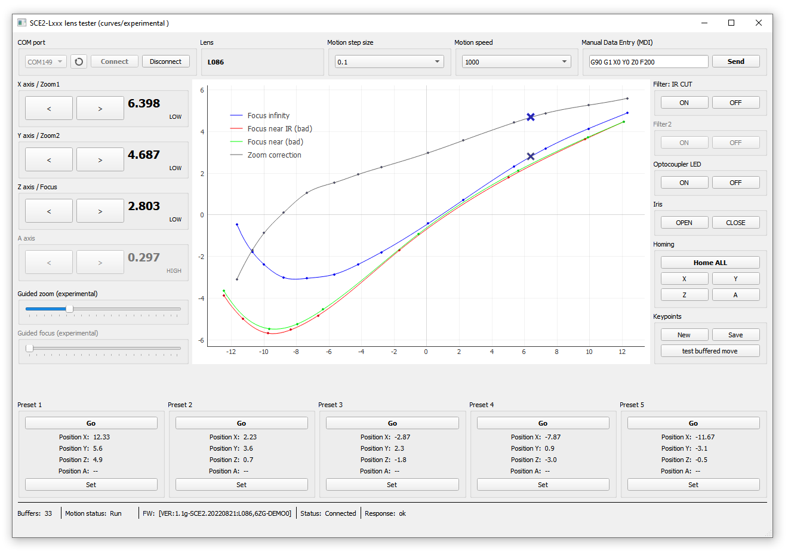

Kurokesu SCF2 multi-axis stepper motor controller System On Module (SOM) based motorized zoom lenses. Detailed documentation can be found on [Kurokesu Wiki](https://wiki.kurokesu.com/books/motorized-zoom-lenses), direct ordering on [Kurokesu E-store](https://www.kurokesu.com/shop/motorized_zoom_lenses)

## Supported lens with dedicated SCE2-M based controller
* [x] L086 (x18, 1/1.8")
* [x] L084 (x40, 1/1.8")
* [x] L085 (x25, 1/2.7")
* [ ] L116 (x5, 1/1.8")
* [x] L117 (x32, 1/1.8")
* [ ] L119 (x16, 4/3")

## Zoom demonstration
[High quality Youtube link](https://www.youtube.com/watch?v=kTpezfnXK4s)

## Lens tester - GUI demo application with optical train curves

## Drive curves can be updated with the procedure
* Make sure controller is running latest firmware and configuration
* Checkout fresh sources
* Connect and press the Home ALL button (yes, no need to home each lens individually anymore)
* Make sure you can control the lens and reach sharp focus in all zoom ranges
* Keypoints->New (it will erase the keypoints.txt file)
* Move the optical train to the widest position and adjust sliders for the best focus, press Keypoints->Save
* There should be no duplicate x positions
* Move optical train towards the narrow position (start saving keypoints from the other direction - right to left)
* Adjust focus in steps (~10 should be enough)
* Once all data points are saved, backup config.yaml file and run import_keypoints.py script. It will import calibration points (for now, using only infinity focus preset)
* Run the main script and test with the Guided zoom slider
* Try to make small changes from the base curve first. At the beginning do not adjust correction axis (zoom2) and adjust only focus.
