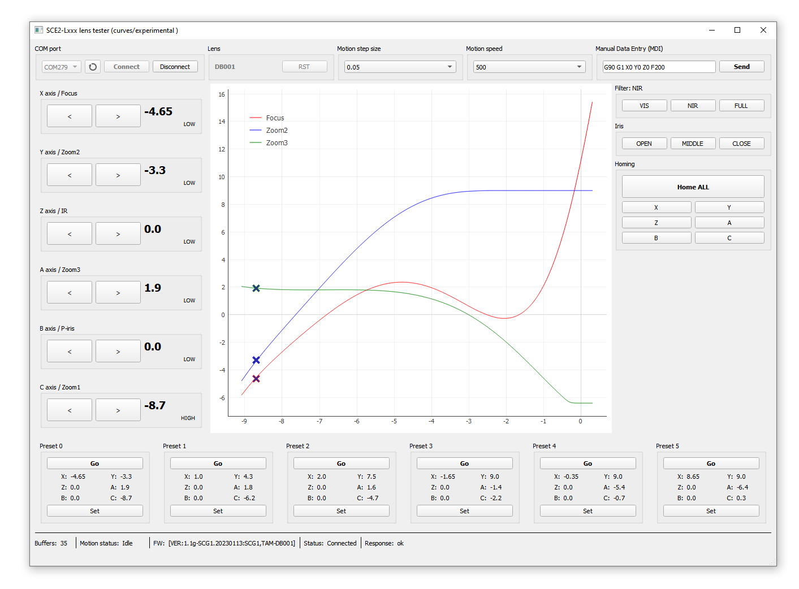

**Recent code for evaluating Kurokesu motorized zoom lenses.**

Kurokesu SCF2 multi-axis stepper motor controller System On Module (SOM) based motorized zoom lenses. Detailed documentation can be found on [Kurokesu Wiki](https://wiki.kurokesu.com/books/motorized-zoom-lenses), direct ordering on [Kurokesu E-store](https://www.kurokesu.com/shop/motorized_zoom_lenses)

