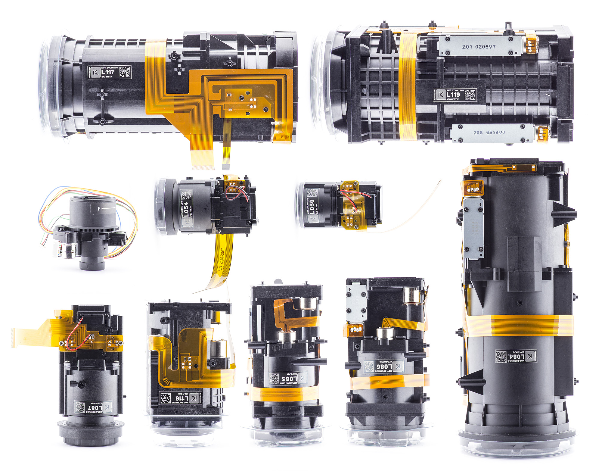
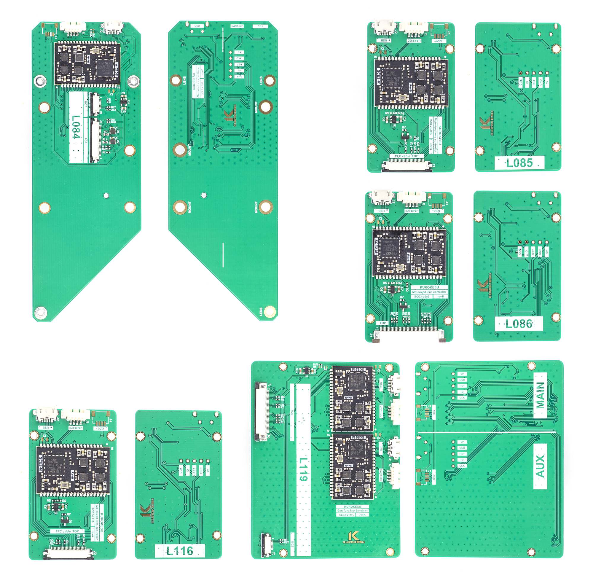

Kurokesu SCF2 multi-axis stepper motor controller System On Module (SOM) based motorized zoom lenses. Detailed documentation can be found on [Kurokesu Wiki](https://wiki.kurokesu.com/books/motorized-zoom-lenses), direct ordering on [Kurokesu E-store](https://www.kurokesu.com/shop/motorized_zoom_lenses)

## Fully tested lens with dedicated SCE2-M based controller
* [x] L086 (x18, 1/1.8")
* [ ] L084 (x40, 1/1.8")
* [ ] L085 (x25, 1/2.7")
* [ ] L116 (x5, 1/1.8")
* [ ] L117 (x32, 1/1.8")
* [ ] L119 (x16, 4/3")


Many new motorized zoom lenses



Some fresh controllers



Lens tester - GUI demo application


## Install Python and run demo

* Download and install https://www.python.org/downloads/windows/ (tested with Python 3.10 on Win10 and Python 3.8.10 on Win7)
  * Check `Add Python 3.8 to PATH` in the first setup window!
  * Restart computer
* Clone (or download archive) github repository: https://github.com/Kurokesu/SCE2-SDK in prefered directory
* Open console at `03_lens_tester_gui` folder
* Install dependences:
```
pip install -r requirements.txt
```

* Run demo with command
```
python main.py
```
